Here is how it looks and the features it has -

This is the home page -
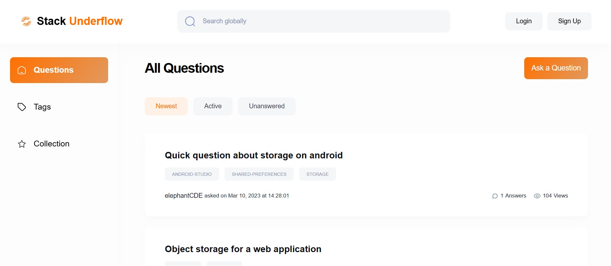

User can log in by clicking on the log in button, and similarly sign up, and by filling the necessary information

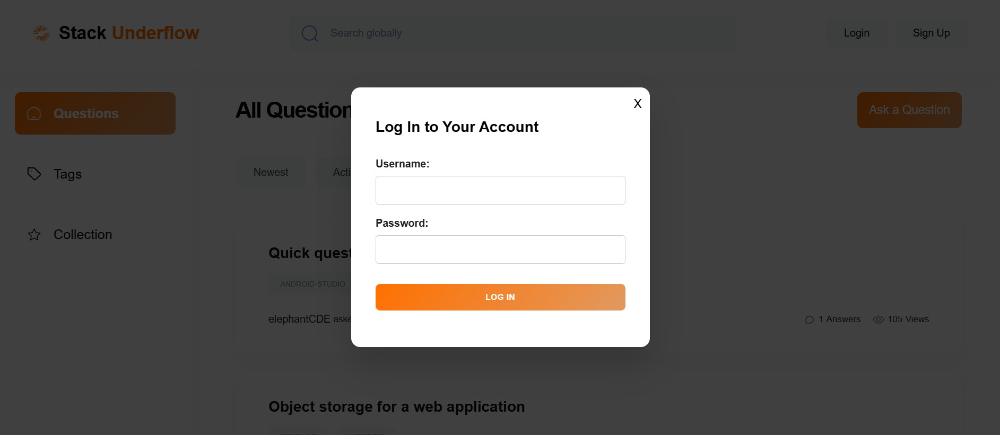
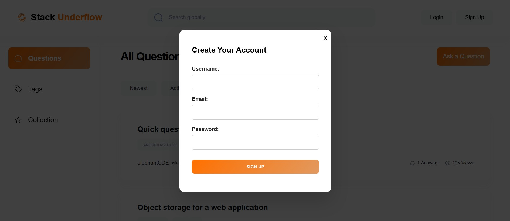

This is how the all questions page look like (This will be the home page of the application)-
User can also sort the questions in this three orders - Newest, Active, Unanswered
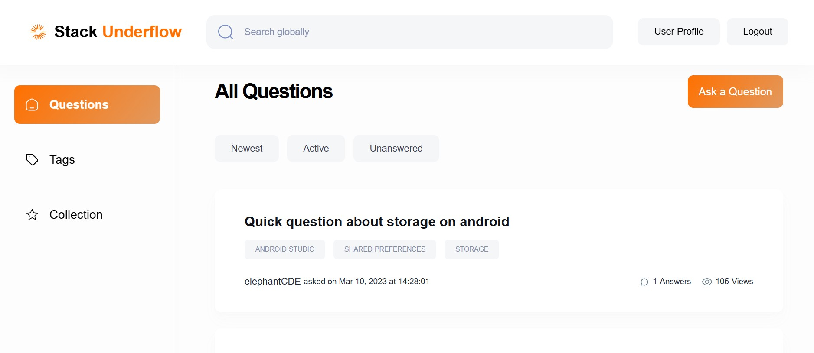

User can click on the "User Profile" button in the nav bar to view and edit the profile information
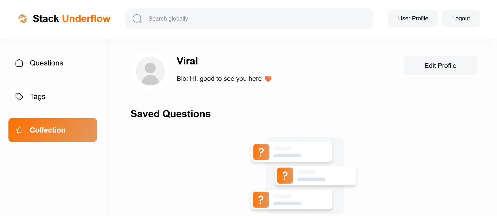
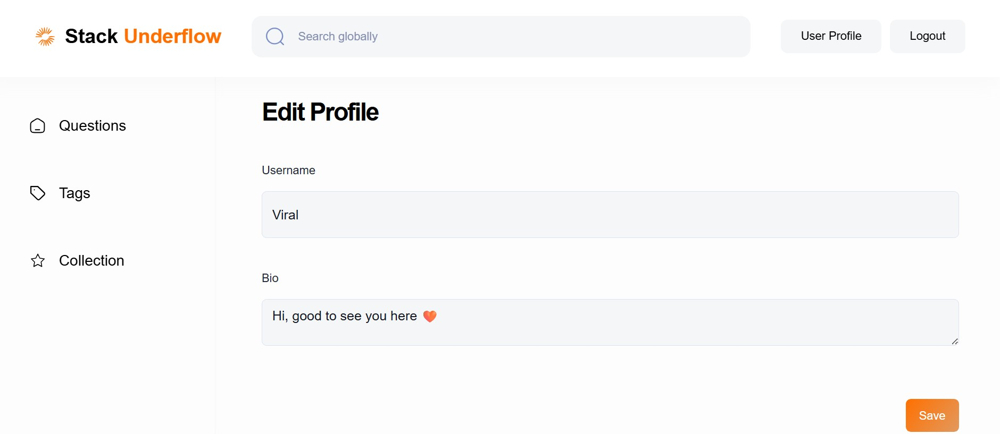

User can ask a question by clicking "Ask the Question" and fill the following details -
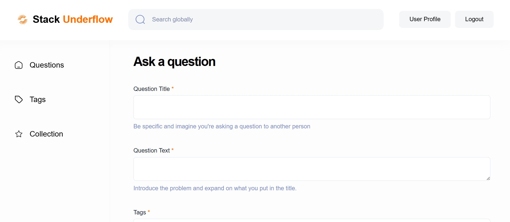
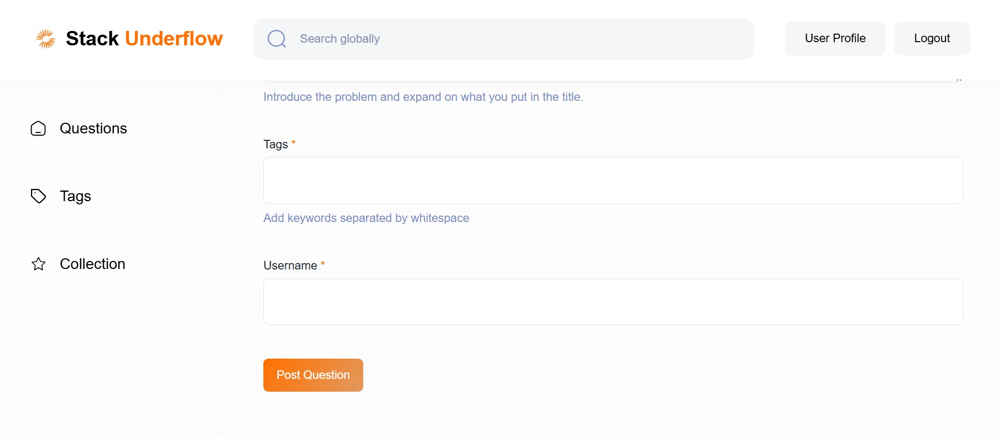

This is the All Tage page, User can click on a particular tag to go to the questions associated with that tag
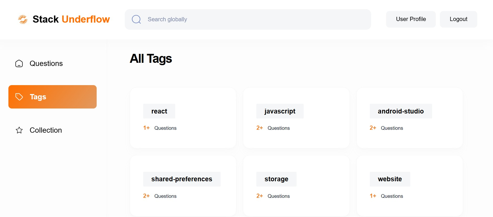

Clicking on a particular question will take user to that particular questions page, where user can upvote, downvote, save, unsave, post comment on the question and associated answers
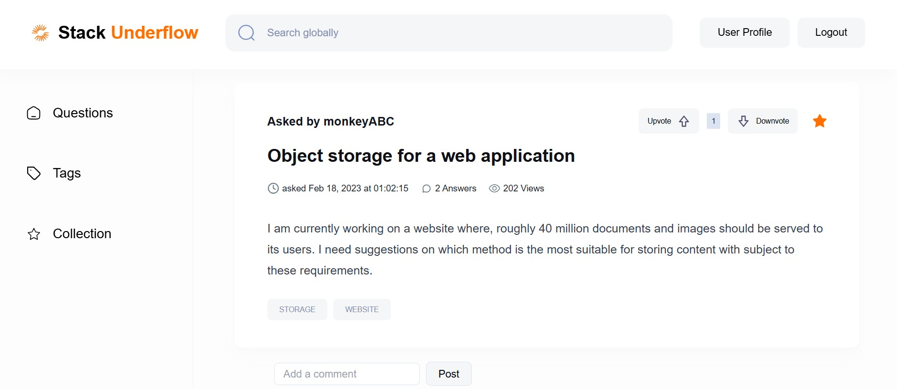
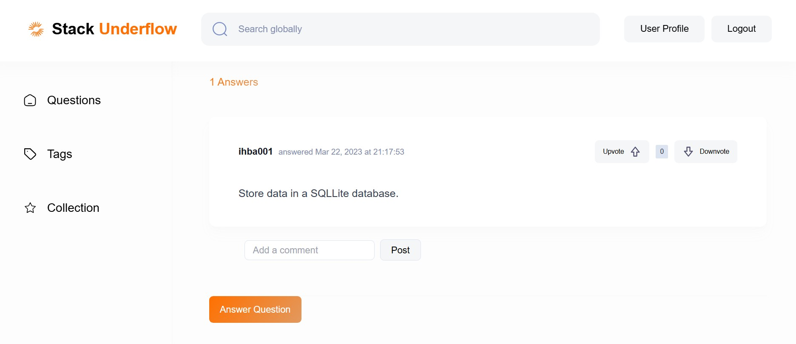

User can post the answer by clicking on "Answer Question" button and fill necessary details
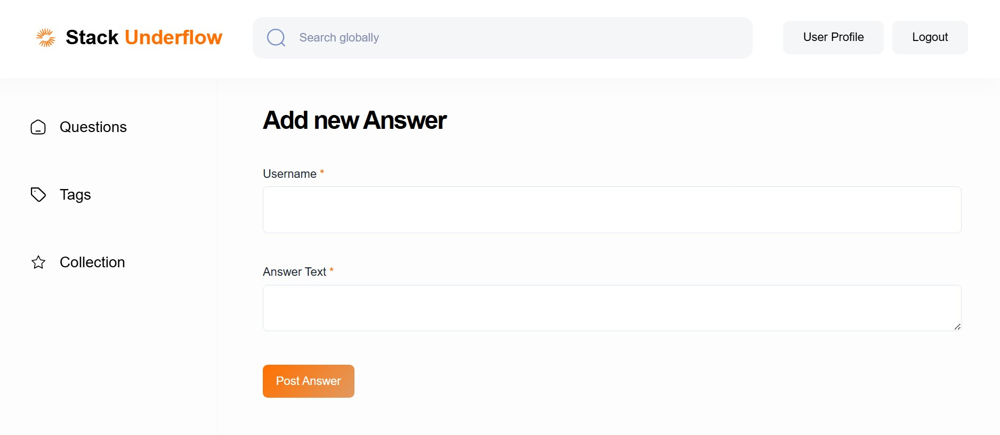

The saved questions can be assesed on the collections page, or on the profile page
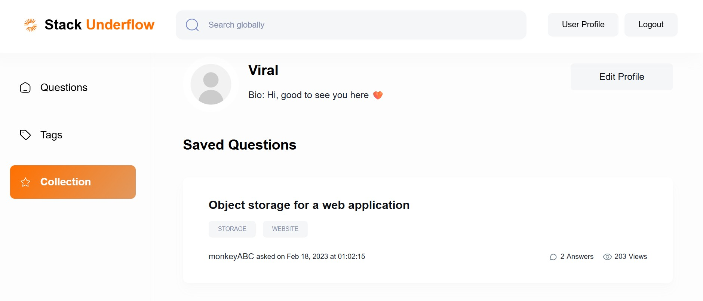

Hope you liked it!
Please reach out to ahirviral01@gmail.com for any feedback/suggestions/queries
